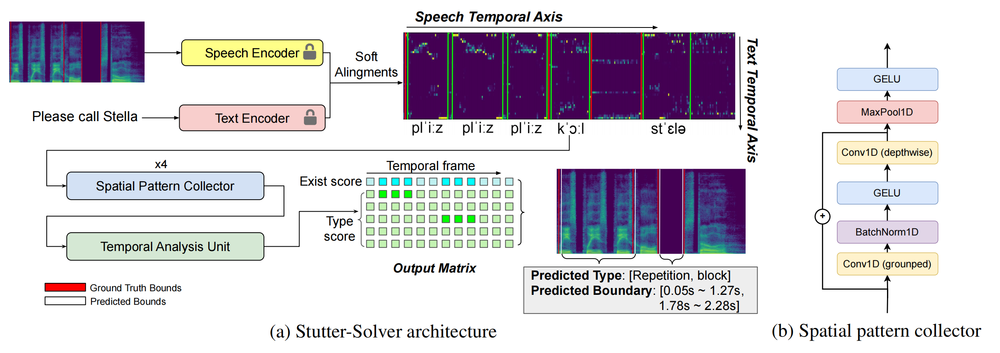

# Stutter-Solver: End-to-end Cross-lingual Dysfluency Detection

## Architecture



## Datasets
We open sourced our three simulated datasets, **VCTK-Art**, **VCTK-Pro** and **AISHELL3-Pro**. 

**Download link will be attached soon.**

### Audio samples

check [Audio samples](https://drive.google.com/drive/folders/1LhYGUhAzkCT7P6JEYTqSV10Yq9ryjb__?usp=sharing)

## Pre-requisites
Please refer [environment.yml](environment.yml)

If you have Miniconda/Anaconda installed, you can directly use the command: `conda env create -f environment.yml`


## Stutter-Solver Inference
We opensourced our inference code and checkpoints, here are the steps to perform inference:

0. Clone this repository

1. Download [VITS pretrained model](https://drive.google.com/drive/folders/1ksarh-cJf3F5eKJjLVWY0X1j1qsQqiS2), here we use `pretrained_ljs.pth`.

2. Download [Stutter-Solver-checkpoints](https://drive.google.com/drive/folders/1EQzAZhmMDdMQy_S0TS73ESZXW4ucb5Eh?usp=sharing), create a folder under `stutter-solver`, named `saved_models`, and put all downloaded models into it.

3. We also provide testing datasets for quick inference, you can download it [here](https://drive.google.com/drive/folders/1OhbylWohKrAVN0JZGKfl0LAKdzXVzlai?usp=sharing).

4. Build Monotonic Alignment Search

```sh
cd stutter-solver/monotonic_align
python setup.py build_ext --inplace
```

5. Run `stutter-solver/etc/inference.ipynb` to perform inference step by step.


## TTS-based Dysfluency Simulation

### English
We use [VITS](https://github.com/jaywalnut310/vits) as our TTS model.

0. Clone this repository

0. Download [VITS pretrained models](https://drive.google.com/drive/folders/1ksarh-cJf3F5eKJjLVWY0X1j1qsQqiS2?usp=sharing), here we need `pretrained_vctk.pth` to achieve multi-speaker.
   1. create a folder `dysfluency_simulation/path/to`, and put the downloaded model into it.

0. Build Monotonoic Alignment Search
```sh
cd dysfluency_simulation/monotonic_align
python setup.py build_ext --inplace
```
3. Generate simulated speech
```sh
# Phoneme level
python generate_phn.py

# Word level
python generate_word.py
```

### Chinese Mandarin
* Switch to [vits-chinese branch](https://github.com/eureka235/Stutter-Solver/tree/vits-chinese)

We use [vits_chinese](https://github.com/PlayVoice/vits_chinese/tree/bert_vits_aishell3?tab=readme-ov-file) as our TTS model for Chinese simulation. Download checkpoints according to its `README` and place it in the specified path.

0. Build Monotonoic Alignment Search
```sh
cd monotonic_align
python setup.py build_ext --inplace
```
1. Generate simulated speech
```sh
python generate_dysfluency.py
```


